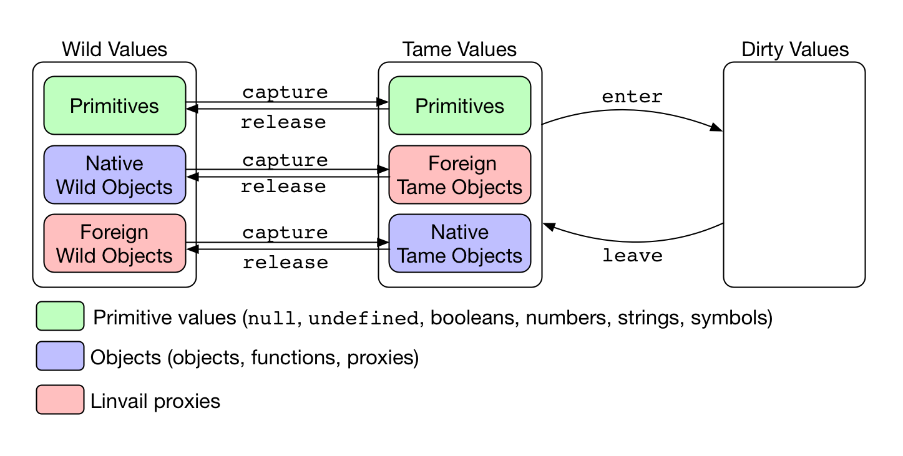

# Linvail

Linvail is [npm module](https://www.npmjs.com/linvail) that implements a control access system around JavaScript code instrumented by [Aran](https://github.com/lachrist/aran).
Linvail's motivation is to build dynamic analyses capable of tracking primitive values across the object graph.

## Getting Started

```sh
npm install acorn aran astring linvail 
```

```js
const Acorn = require("acorn");
const Aran = require("aran");
const Astring = require("astring");
const Linvail = require("linvail");

const aran = Aran({namespace:"META", sandbox:true});
const instrument = (script, parent) =>
  Astring.generate(aran.weave(Acorn.parse(script), pointcut, parent));
let counter = 0;
const linvail = Linvail({
  instrument: instrument,
  enter: (value) => ({base:value, meta:"#"+(counter++)}),
  leave: (value) => value.base
});
const pointcut = Object.keys(linvail.advice);

global.META = Object.assign({}, linvail.advice);
global.META.primitive = (primitive, serial) => {
  const result = linvail.advice.primitive(primitive, serial);
  console.log(result.meta+"("+result.base+") // @"+serial);
  return result;
};
global.META.binary = (operator, left, right, serial) => {
  const result = linvail.advice.binary(operator, left, right, serial);
  console.log(result.meta+"("+result.base+") = "+left.meta+" "+operator+" "+right.meta+" // @"+serial);
  return result;
};

global.eval(Astring.generate(aran.setup()));
global.eval(instrument(`
let division = {};
division.dividend = 1 - 1;
division.divisor = 20 - 2 * 10;
division.result = division.dividend / division.divisor;
if (isNaN(division.result))
  console.log("!!!NaN division result!!!");
`));
```

```
#6(apply) // @2
#10(defineProperty) // @2
#14(getPrototypeOf) // @2
#18(keys) // @2
#22(iterator) // @2
#24(undefined) // @2
#26(dividend) // @6
#27(1) // @9
#28(1) // @10
#29(0) = #27 - #28 // @8
#30(divisor) // @12
#31(20) // @15
#32(2) // @17
#33(10) // @18
#34(20) = #32 * #33 // @16
#35(0) = #31 - #34 // @14
#36(result) // @20
#37(dividend) // @23
#38(divisor) // @25
#39(NaN) = #29 / #35 // @22
#42(result) // @30
#45(log) // @33
#46(!!!NaN division result!!!) // @35
!!!NaN division result!!!
```

## Demonstrators

* [demo/analysis/identity-explicit.js]https://cdn.rawgit.com/lachrist/linvail/c92cbbb3/demo/output/identity-explicit-delta.html
  Demonstrate the API of linvail but don't produce any observable effect.
* [demo/analysis/identity](https://cdn.rawgit.com/lachrist/linvail/c92cbbb3/demo/output/identity-delta.html):
  Same as above but uses the simplified live API of Aran.
* [demo/analysis/wrapper](https://cdn.rawgit.com/lachrist/linvail/c92cbbb3/demo/output/wrapper-delta.html):
  Every values entering instrumented areas are wrapped to provide a well-defined identity.
  Every wrapper leaving instrumented areas are unwrapped so the behavior of the base program is not altered.
  Wrapping and unwrapping operations are logged.
* [demo/analysis/concolic](https://cdn.rawgit.com/lachrist/linvail/c92cbbb3/demo/output/concolic-delta.html):
  Same as above but also logs the arguments and result of triggered aran's traps.
  The resulting log is a detailed data-flow trace which with proper formating can be fed to a SMT solver.

## API



* A *base value* is either:
  * a primitive
  * a reference which satisfies the below constraints:
    * its prototype is a base value
    * the values of its data properties are base values
    * the getters and setters of its accessor properties are base values
    * applying it with a base value this-argument and base value arguments will return a base value
    * constructing it with base value arguments will return a base value
* A *meta value* is either:
  * a primitive
  * a reference which satisfies the below constraints:
    * its prototype is a meta value.
    * the values of its data properties are inner values
    * the getters and setters of its accessor properties are meta values
    * applying it with a meta value this-argument and inner value arguments will return an inner value
    * constructing it with base value arguments will return an inner value

### `linvail = require("linvail")(membrane)`

* `membrane :: object`
  * `inner = membrane.enter(meta)`:
  User-defined function to convert a meta value to an inner value.
  * `meta = membrane.leave(inner)`:
  User-defined function to convert an inner value to a meta value.
  * `instrumented = membrane.instrument(code, serial)`:
  This function will be called to transforms code before passing it to the infamous `eval` function.
    * `code :: string`
    * `serial :: number`
    * `instrumented :: string`
* `linvail :: object`
  * `linvail.advice :: object`
  An aran advice, contains Aran traps and a `SANDBOX` field which is set to `linvail.metaof(global)`.
  The actual traps triggered by Aran can 
  * `linvail.membrane :: object`:
  The same object as the membrane arguments.
  * `base = linvail.baseof(meta)`:
  Convert a meta value into a base value.
  * `meta = linvail.metaof(base)`
  Convert a base value into a meta value.

## Discussion

[Aran](https://github.com/lachrist/aran) and program instrumentation in general is good for introspecting the control flow and tracking pointers.
Things become more difficult when the analysis has to reason about primitive values as well.
For instance, there is no way at the JavaScript language level to differentiate two `null` values even though they have a different origin.
This restriction strikes every JavaScript primitive values because they are inlined into different parts of the program's state -- e.g the environment and the value stack.
All of these copying blur the concept of a primitive value's identity and lifetime.
On the contrary, objects can be properly differentiated based on their address in the store.
Such situation happens in almost every mainstream programming languages.
We now discuss several strategies to provide an identity to primitive values:
1. *Shadow States*
  For low-level languages such as binary code, primitive values are often tracked by maintaining a so called "shadow state" that mirrors the concrete program state.
  This shadow state contains analysis-related information about the program values situated at the same location in the concrete state. 
  [Valgrind](http://valgrind.org/) is a popular binary instrumentation framework which utilizes this technique to enables many data-flow analyses.
  The difficulty of this technique lies in maintaining the shadow state as non-instrumented functions are being executed.
  In JavaScript this problem typically arises when objects are passed to non instrumented functions such as built-ins.
  Keeping the shadow store in sync during such operation requires to know the exact semantic of the non-instrumented function. 
  Since they are so many different builtin functions in JavaScript, this is a very hard thing to do.
2. *Record And Replay*
  Record and replay systems such as [Jalangi](https://github.com/SRA-SiliconValley/jalangi) are an intelligent response to the challenge of keeping in sync the shadow states with the concrete state.
  Acknowledging that divergences between the shadow and concrete states cannot be completely avoided, these systems allows divergences in the replay phase which can be resolved by the trace gathered during the record phase.
  We propose two arguments against such technique:
  First, every time divergences are resolved in the replay phase, values with unknown origin are being introduced which necessarily diminish the precision of the resulting analysis.
  Second, the replay phase only provide information about partial execution which can be puzzling to reason about.
3. *Wrappers*
  Instead of providing a entire separated shadow state, wrappers constitutes a finer grained solution.
  By wrapping primitive values inside objects we can simply let them propagate through the data flow of the base program.
  The challenge introduced by wrappers is to make them behave like their wrapped primitive value to non-instrumented code.
  1. *Boxed Values*
    JavaScript enables to box booleans, numbers and strings.
    Despite that: symbols, `undefined` and `null` cannot be tracked by this method, boxed values do not always behave like their primitive counterpart.    
    ```js
    // Strings cannot be differentiated based on their origin
    let string1 = "abc";
    let string2 = "abc";
    assert(string1 === string2);
    // Boxed strings can be differentiated based on their origin
    let boxed_string1 = new String("abc");
    let boxed_string2 = new String("abc");
    assert(boxed_string1 !== boxed_string2);
    // In some cases boxed string behave like strings.
    assert(string1 + string2 === boxed_string1 + boxed_string2);
    assert(JSON.stringify({a:string1}) === JSON.stringify({a:boxed_string1}));
    // In some other cases they don't...
    string1.foo = "bar";
    boxed_string1.foo = "bar";
    assert(string1.foo !== boxed_string1.foo);
    ```
  2. *valueOf method*
    A similar mechanism to boxed value is to use the `valueOf` method.
    Many builtin JavaScript procedures expecting a primitive value but receiving on object will try to convert this object into a primitive using its `valueOf` method.
    ```js
    var x = null
    var xValueOf = {
      inner: null,
      valueOf: function () { this.inner }
    }
    assert(JSON.stringify({a:x}) !== JSON.stringify({a:xValueOf}));
    ```
    Under the hood, boxed primitive values are using the `valueOf` method to convert an object
  3. *explicit wrapper*
  Finally a last options consists in using explicit wrappers which should cleanup before escaping to non-instrumented code.
  This requires to setup an access control system between instrumented code and non-instrumented code.
  This the solution that Linvail directly enables.

## Acknowledgments

I'm [Laurent Christophe](http://soft.vub.ac.be/soft/members/lachrist) a phd student at the Vrij Universiteit of Brussel (VUB).
I'm working at the SOFT language lab in close relation with my promoters [Coen De Roover](http://soft.vub.ac.be/soft/members/cderoove) and [Wolfgang De Meuter](http://soft.vub.ac.be/soft/members/wdmeuter).
I'm currently being employed on the [Tearless](http://soft.vub.ac.be/tearless/pages/index.html) project.

<!-- 
1. **Debugging NaN appearances**
  In this first example, we want to provide an analysis which tracks the origin of `NaN` (not-a-number) values.
  The problem with `NaN` values is that they can easily propagate as the program is executed such that detecting the original cause of a `NaN` appearance is often tedious for large programs.
  Consider the program below which alerts "Your age is: NaN".
  ```js
  var year = Number(document.getElementById("bdate").avlue);
  // many lines with many unrelated NaNs appearances
  alert("Your age is: " + (2016 - year));
  ```
  Simply printing every appearance of `NaN` values runs under the risk of overwhelming the programmer with unrelated `NaN` appearances.
  We would like to know only of the `NaN` that caused the alert to display an buggy message.
  It is therefore crucial to differentiate `NaN` values which cannot be done at the JavaScript language level.

2. **Taint analysis**
  Taint analysis consists in marking -- or *tainting* -- values coming from predefined source of information and preventing them from flowing through predefined sinks of information.
  As tainted values are manipulated through the program, the taint should be properly propagated to dependent values. 
  ```js
  var password = document.getElementById("password"); // predefined source
  var secret = password.value; // tainted string
  var secrets = secret.split(""); // array of tainted characters
  sendToShadyThirdPartyServer(secrets); // predefined sink
  ```
  Lets suppose that the password was `"trustno1"`.
  N.B. strings are primitive values in JavaScript.
  After splitting this string to characters we cannot simply taint all string being `"t"`, `"r"`, `"u"`, `"s"`, `"t"`, "`n`", "`o`", `"1"`.
  This would lead to serious over-tainting and diminish the precision and usefulness of the analysis.
  As for the `Nan` debugger we crucially need to differentiate primitive values based on their origin and not only their value.

3. **Concolic Testing**
  Concolic testing aims at automatically exploring all the control-flow paths a program can take for validation purpose.
  It involves gathering mathematic formula on a program's inputs as it is being executed.
  Later, these formula can be given to a constraint solver to steer the program into a unexplored execution path.
  Consider the program below which has two different outcomes based on the birthdate of the user.
  A successful concolic tester should be able to generate an birthdate input that leads the program to the consequent branch and an other birthdate input that leads the program to the alternate branch.
  ```js
  var input = document.getElemenById("bdate").value;
  var bdate = input.value // new symbolic value [α]
  var age = bdate - 2016; // new constraint [β = α - 2016]
  var isminor = age > 17; // new constraint [γ = β > 17]
  if (isminor) {          // path condition [γ && γ = β > 17 && β = α - 2016]
    // do something
  } else {                // path condition [!γ && γ = β > 17 && β = α - 2016]
    // do something else
  }
  ```
  It should be clear that confusing two primitive values having different origin would easily lead to erroneous path constraint.
 -->